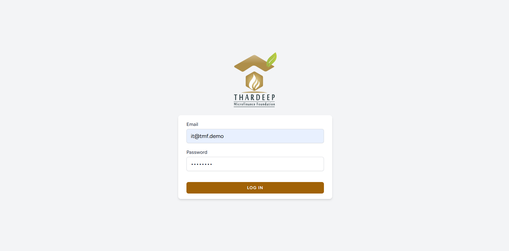
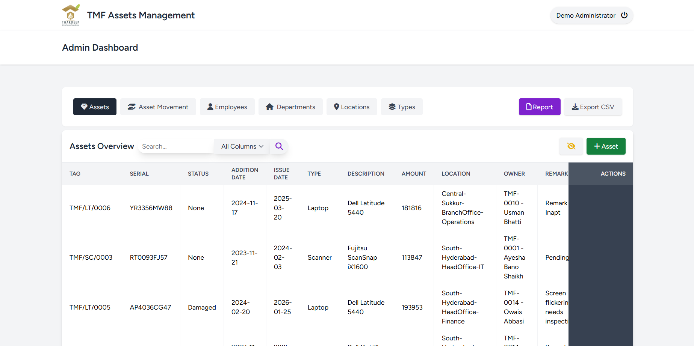
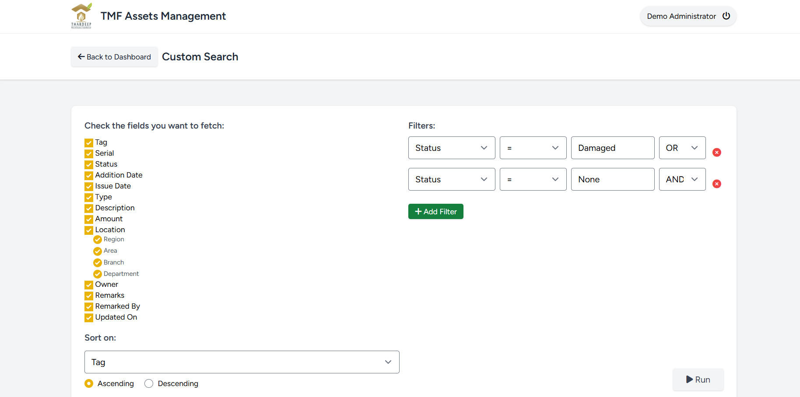
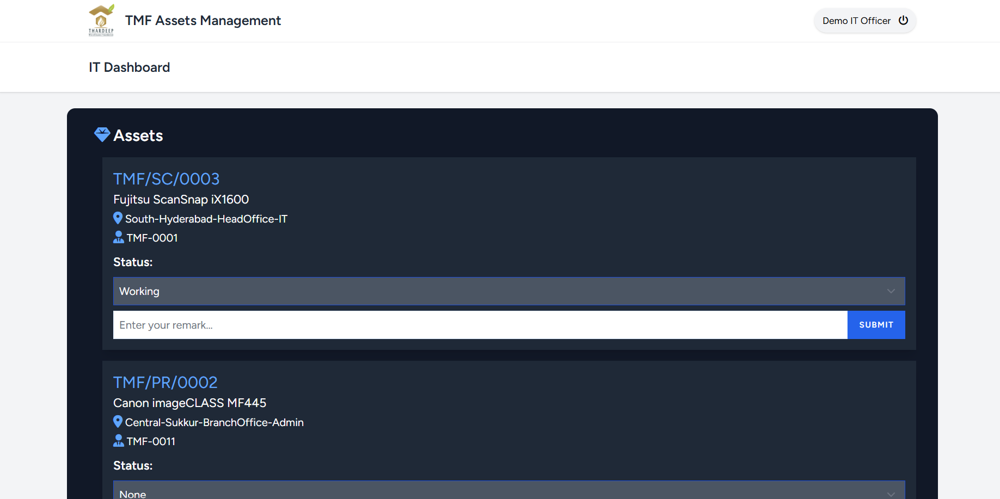
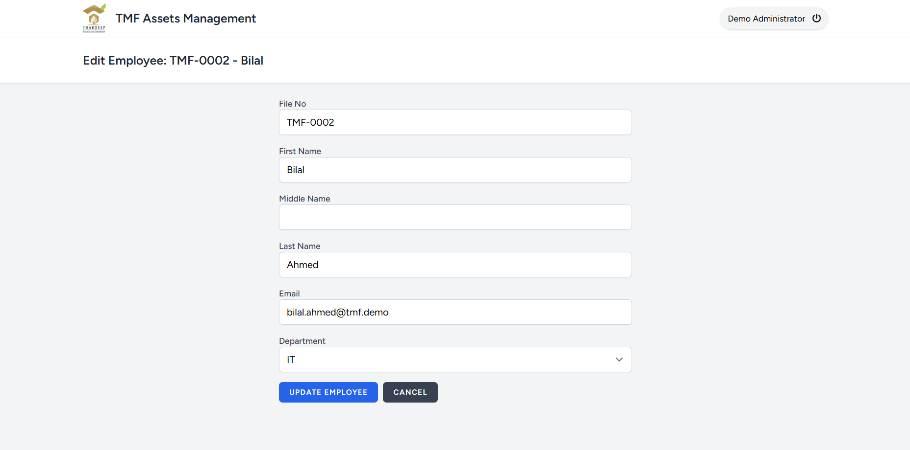

<h1 align="center">TMF Asset Manager</h1>

<p align="center">
  <strong>A role-based IT asset lifecycle & tracking system for a multi-branch microfinance network.</strong><br>
  Laravel 12 · Tailwind CSS · MySQL / SQLite
</p>

<p align="center">
  
  
  
  
</p>

<p align="center">
  <a href="#-live-demo"><strong>🌐 Live Demo</strong></a> ·
  <a href="docs/DOCUMENTATION.md"><strong>📖 Full Documentation</strong></a> ·
  <a href="#-screenshots"><strong>🖼 Screenshots</strong></a> ·
  <a href="#-quick-start"><strong>🚀 Quick Start</strong></a>
</p>

<p align="center">
  
</p>

---

## 📌 Overview

**TMF Asset Manager** is a **prototype** IT-asset management web application I built during my internship at **Thardeep Microfinance Foundation (TMF)**, from requirements gathered across three departments, to move asset tracking off spreadsheets into a structured system spanning multiple regions, branches and departments.

It answers the questions an asset registry has to answer every day:

- *What do we own, where is it, and who is using it?*
- *When an asset moves from one employee/branch to another, is that transfer recorded and verified?*
- *Which devices are damaged or awaiting an IT inspection?*
- *Give me a filtered report of all laptops in the South region — as a downloadable file.*

The system separates duties between an **Admin** (manages the registry) and an **IT Officer** (reviews and signs off on the technical condition of assets), and keeps a full **audit trail** of every asset movement.

> ℹ️ The public demo is seeded with **entirely fictional** data. No real employee, asset, or credential from TMF is included.

---

## ✨ Features

Everything below is implemented and working in the app:

| Feature | Description |
|---------|-------------|
| 🔐 **Authentication & role-based access** | Session login; two roles — **Admin** and **IT** — with route-level middleware guarding every action. |
| 💻 **Asset records — add / edit / delete** | Full CRUD for assets: tag, serial, type, purchase/issue dates, cost, description, owner, location and condition status. |
| 🔎 **Quick search** | Instant free-text search across the asset table, scoped to a single column or all columns. |
| 👁 **Column visibility options** | Show/hide individual table columns; the preference is remembered per table. |
| 🔁 **Asset movement tracking** | "Shift" an asset to a new owner/location; every transfer is written to an append-only **audit history**. |
| 🛠 **IT panel — remarks & state updates** | A dedicated IT dashboard queue where the officer sets condition (**Working / Damaged**) and records a remark, clearing the review flag. |
| 🧩 **Advanced search (query builder)** | Multi-condition filtering with **AND/OR** logic across any field, including drilling into the hierarchical location (Region → Area → Branch → Department), selectable output columns and sort order. |
| 📊 **Report generator** | Guided report builder with cascading location selectors and date/amount ranges, rendered in a printable view. |
| 📤 **CSV exports** | One-click export of the dashboard, advanced-query results and reports — respecting the columns you selected. |
| 🗂 **Reference data management** | Manage employees, departments, asset types and locations as first-class records. |

---

## 🧱 Tech Stack

- **Backend:** PHP 8.2, Laravel 12 (Eloquent ORM, Blade, route middleware, SQL views)
- **Frontend:** Blade templates, Tailwind CSS, Vite, vanilla JS (cascading dropdowns)
- **Database:** MySQL / MariaDB (original build); **SQLite** for the zero-setup demo
- **Auth:** Laravel Breeze (session auth) with a custom `role` guard
- **Tooling:** Composer, npm, Docker

---

## 🌐 Live Demo

> 🔗 **Live:** **https://tmf-asset-manager.onrender.com**
>
> ⏳ Hosted on Render's free tier — the instance sleeps after inactivity, so the **first load can take ~50 seconds** to wake up. Reloads after that are fast.

**Demo credentials**

| Role | Email | Password |
|------|-------|----------|
| Admin | `admin@tmf.demo` | `password` |
| IT Officer | `it@tmf.demo` | `password` |

*(The free host sleeps after inactivity — the first request may take ~30–60s to wake.)*

---

## 🖼 Screenshots

### Admin dashboard — search, column visibility & CSV export
The central registry: quick search, an **All Columns** visibility toggle, one-click **Export CSV**, and per-row edit/delete actions. Owner names are resolved from file numbers via a SQL view.



### Advanced search / query builder
Pick exactly which fields to fetch, chain multiple **column · operator · value** conditions with **AND/OR**, filter by any part of the location hierarchy, choose the sort order, and export the result.



### IT panel — condition remarks & state updates
The IT officer's review queue. Each pending asset/transfer shows its details; the officer sets **Working / Damaged** and submits a remark, which updates the asset and clears it from the queue.



### Record management (add / edit / delete)
Clean forms for every entity — here, editing an employee record used as an asset owner.



---

## 🚀 Quick Start

### Option A — Zero-setup with SQLite (recommended)

No MySQL/XAMPP needed. Requires PHP 8.2+, Composer, and Node 18+.

```bash
git clone https://github.com/AbdulTawabJ/asset-manager.git
cd asset-manager

composer install
npm install && npm run build

cp .env.example .env          # defaults to SQLite
php artisan key:generate
php artisan migrate --seed     # creates & seeds database/database.sqlite

php artisan serve
```

Visit **http://localhost:8000** and log in with the demo credentials above.

### Option B — Run with Docker (no PHP/Node install needed)

```bash
docker build -t tmf-asset-manager .
docker run --rm -p 8000:8000 tmf-asset-manager
```

Then open **http://localhost:8000**.

### Option C — MySQL / MariaDB (original setup)

1. Create a database named `asset_management_db`.
2. In `.env`, switch `DB_CONNECTION=mysql` and fill in the MySQL block (see `.env.example`).
3. Run `php artisan migrate --seed`.

---

## 🗺 How it works (at a glance)

```
Admin  ──▶  manages assets, employees, departments, types, locations
   │
   ├─▶  shifts an asset ──▶  asset_history (audit trail)  ──┐
   │                                                        │ flagged "requires IT remark"
   └─▶  flags an asset for IT review ──────────────────────▶│
                                                            ▼
IT Officer  ──▶  reviews queue, records condition (Working/Damaged) + remark
```

Assets and history are read through two SQL **views** (`asset_display`, `asset_history_display`) that resolve each employee file number into a friendly full name. See the [full documentation](docs/DOCUMENTATION.md) for the ERD, use cases and sequence flows.

---

## 📚 Documentation

Detailed software documentation — scope, requirements, ERD, data dictionary, actors & use cases, and workflow sequence diagrams (with screenshots) — is in **[`docs/DOCUMENTATION.md`](docs/DOCUMENTATION.md)**.

---

## 👤 Author

**Abdul Tawab**
Built during an internship at Thardeep Microfinance Foundation.

- GitHub: [@AbdulTawabJ](https://github.com/AbdulTawabJ)
<!-- - LinkedIn: TODO add your profile link -->

---

## 📄 License

Released under the [MIT License](LICENSE).
