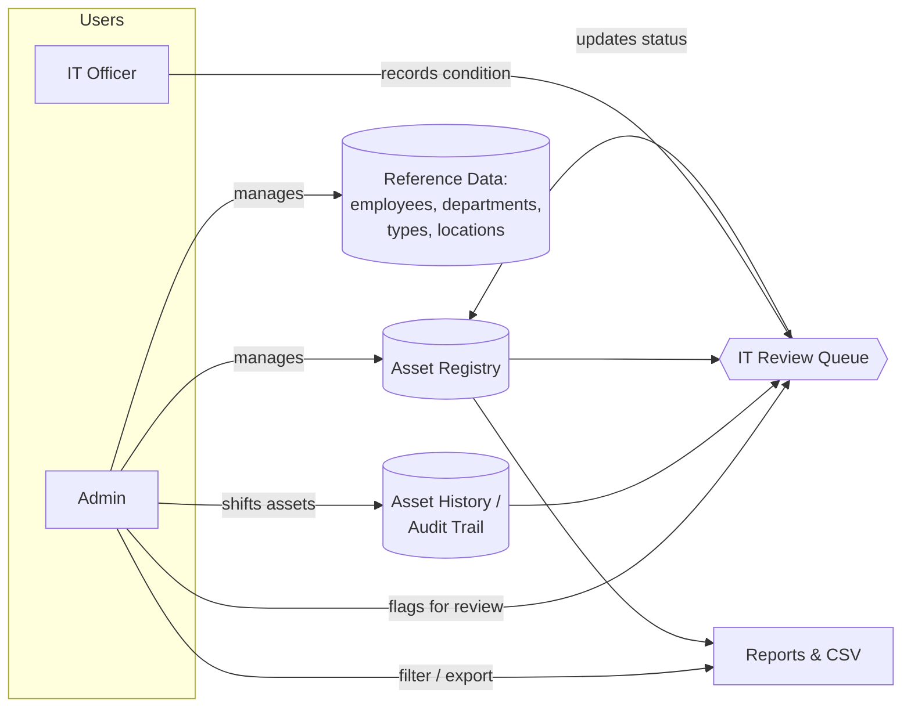
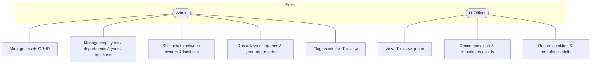
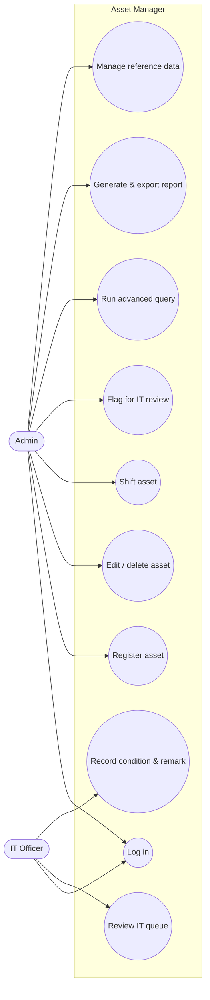
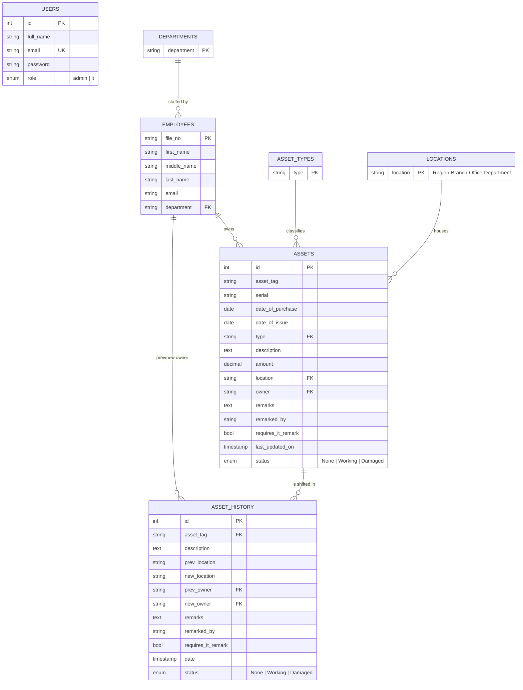
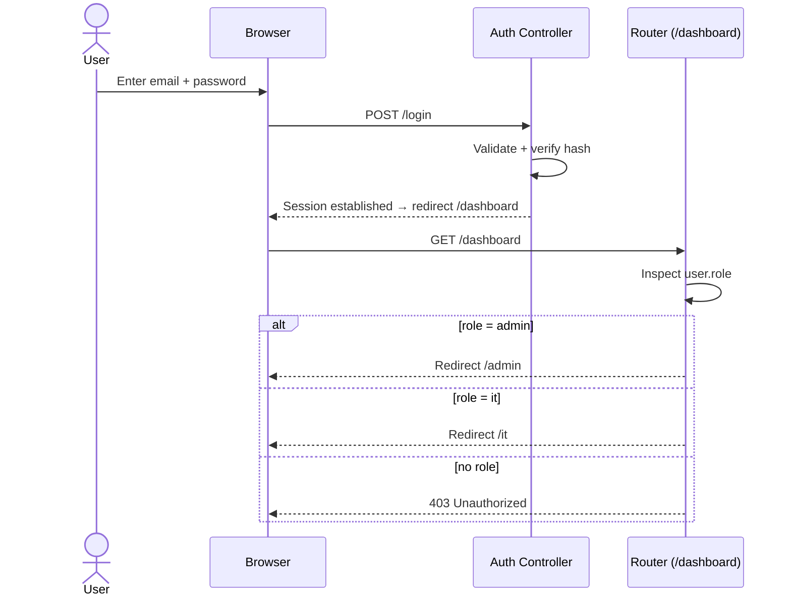
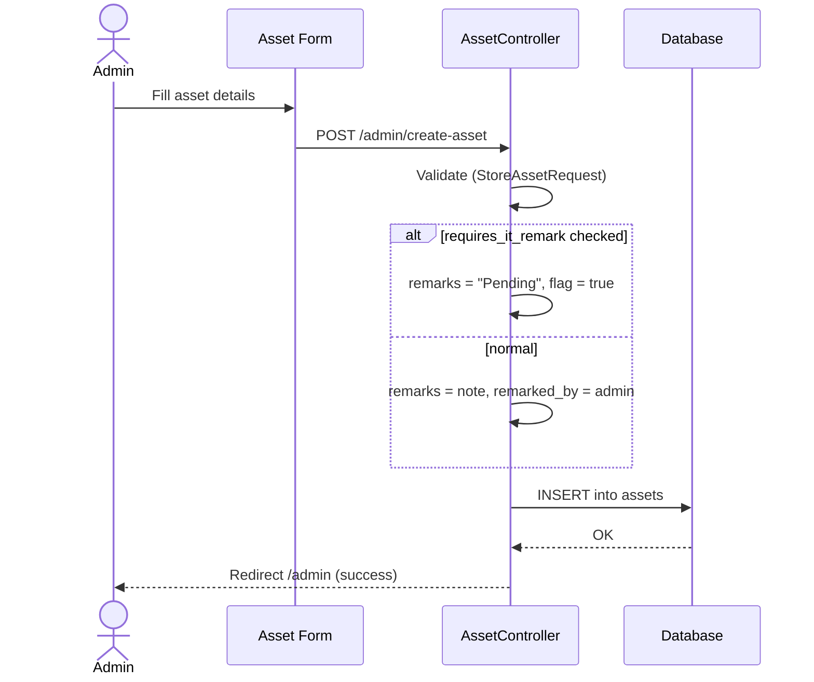
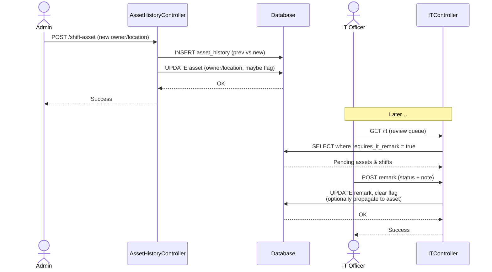
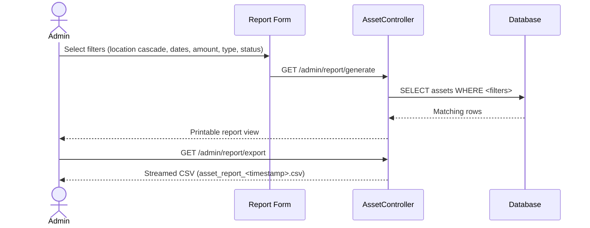
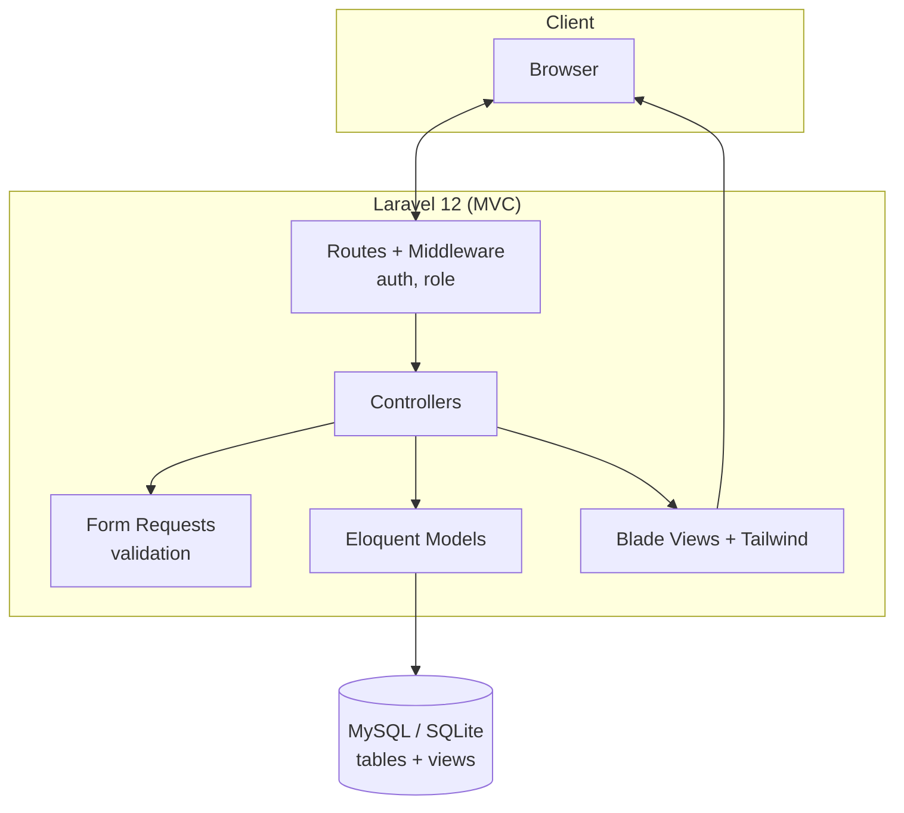

# TMF Asset Manager — Software Documentation

**Project:** IT Asset Lifecycle & Tracking System
**Organisation context:** Thardeep Microfinance Foundation (internship project)
**Author:** Abdul Tawab
**Stack:** Laravel 12 · PHP 8.2 · Tailwind CSS · MySQL / SQLite
**Status:** Internship prototype (functional demo)
**Live demo:** https://tmf-asset-manager.onrender.com
**Document type:** Combined SRS (Software Requirements Specification) + SDS (Software Design Specification)

> All sample data referenced in this document is fictional. No real organisational data is disclosed.

---

## Table of Contents

1. [Introduction](#1-introduction)
2. [System Overview](#2-system-overview)
3. [Actors & Roles](#3-actors--roles)
4. [Functional Requirements](#4-functional-requirements)
5. [Non-Functional Requirements](#5-non-functional-requirements)
6. [Use Cases](#6-use-cases)
7. [Data Model & ERD](#7-data-model--erd)
8. [Data Dictionary](#8-data-dictionary)
9. [Key Workflows (Sequence Diagrams)](#9-key-workflows-sequence-diagrams)
10. [Architecture & Design](#10-architecture--design)
11. [Security Considerations](#11-security-considerations)
12. [Future Enhancements](#12-future-enhancements)

---

## 1. Introduction

### 1.1 Purpose
This document specifies the requirements and design of the **TMF Asset Manager**, a web application for recording, assigning, transferring and inspecting the IT assets of a multi-branch microfinance organisation. It is intended for developers, reviewers, and stakeholders evaluating the system.

### 1.2 Scope
The system provides a central registry of IT assets and the people, departments and locations they relate to. It supports the complete day-to-day lifecycle of an asset:

- **Onboarding** — registering a new asset with its specification, cost and owner.
- **Assignment & movement** — transferring ("shifting") an asset to a new owner or location while preserving a full audit trail.
- **Condition management** — a distinct IT review workflow that records whether an asset is Working or Damaged.
- **Reporting & export** — advanced filtering, printable reports and CSV export.

Out of scope: procurement/purchase orders, financial depreciation accounting, and end-user self-service.

### 1.3 Definitions
| Term | Meaning |
|------|---------|
| **Asset** | A physical IT item (laptop, printer, router, …) tracked by a unique **asset tag**. |
| **Shift** | A recorded transfer of an asset from a previous owner/location to a new one. |
| **File No** | An employee's unique staff file number; used as the owner reference on assets. |
| **Remark** | An IT officer's condition note (Working / Damaged / None) on an asset or shift. |
| **Location** | A hierarchical string `Region-Branch-Office-Department`. |

---

## 2. System Overview

The application is a classic server-rendered Laravel MVC app. Two SQL views (`asset_display`, `asset_history_display`) denormalise owner file numbers into human-readable names for listing, searching and reporting.

### 2.1 Feature Catalogue

| Capability | Where | Notes |
|------------|-------|-------|
| Authentication & role-based access | Login → role dashboard | Admin vs IT, enforced by middleware |
| Asset records: **add / edit / delete** | Admin dashboard | Full CRUD via form requests |
| **Quick search** | Admin dashboard | Free-text, all-columns or single-column |
| **Column visibility** | Admin dashboard | Show/hide columns, remembered per table |
| **Asset movement tracking** | Shift asset | Append-only `asset_history` audit trail |
| **IT remarks & state updates** | IT panel | Working/Damaged + remark, clears review flag |
| **Advanced search / query builder** | Custom Search | Multi-condition AND/OR, location parts, sort |
| **Advanced report builder** | Report | Cascading location + date/amount ranges |
| **CSV exports** | Dashboard, query, report | Column-aware downloads |
| Reference data management | Employees/Departments/Types/Locations | First-class CRUD |

**Admin dashboard** — quick search, column-visibility toggle, CSV export, per-row actions:

**Advanced search (query builder)** — field selection, AND/OR conditions, location parts, sort:

**IT panel** — condition status + remark submission:

**Record management** — representative CRUD form:

---

## 3. Actors & Roles

| Role | Description | Access |
|------|-------------|--------|
| **Admin** | Owns the registry and reference data; performs all data entry and transfers. | Full CRUD + reporting; guarded by `role:admin` middleware. |
| **IT Officer** | Technical reviewer; signs off on the physical condition of assets and transfers. | Read + the remark actions on the IT dashboard; guarded by `role:it` middleware. |

Both roles authenticate via session-based login. `/dashboard` inspects the authenticated user's role and redirects to `/admin` or `/it` accordingly.

---

## 4. Functional Requirements

### 4.1 Authentication & Authorisation
- **FR-1** The system shall authenticate users by email + password.
- **FR-2** The system shall route users to a role-appropriate dashboard after login.
- **FR-3** The system shall deny access to admin-only and IT-only routes based on the user's `role` via middleware.

### 4.2 Asset Management (Admin)
- **FR-4** Create an asset with tag, serial, type, purchase date, issue date, amount, description, location and owner.
- **FR-5** Edit and delete existing assets.
- **FR-6** List assets with pagination and free-text search across all displayed columns (via `asset_display`).
- **FR-7** Optionally flag an asset as *requires IT remark* at creation/edit; such assets show `Pending` and enter the IT queue.

### 4.3 Asset Shifting & Audit Trail (Admin)
- **FR-8** Transfer an asset to a new owner and/or location.
- **FR-9** Persist every transfer as an `asset_history` record capturing previous & new owner/location, date and status.
- **FR-10** Optionally flag a shift as *requires IT remark*.

### 4.4 IT Review (IT Officer)
- **FR-11** Present a queue of assets and shifts awaiting review, ordered oldest-first.
- **FR-12** Record a condition status (Working / Damaged) and a free-text remark, clearing the review flag.
- **FR-13** When a shift is remarked, optionally propagate the condition/remark to the underlying asset.

### 4.5 Advanced Query (Admin)
- **FR-14** Build multi-condition filters combining fields with AND/OR logic.
- **FR-15** Filter by any segment of the hierarchical location (region/area/branch/department).
- **FR-16** Choose visible fields and sort order; paginate results.

### 4.6 Reporting & Export
- **FR-17** Provide a guided report form with cascading Region → Branch → Office → Department selectors and date/amount ranges.
- **FR-18** Render results in a printable report view.
- **FR-19** Export the dashboard, advanced-query results and reports as CSV, respecting user-selected columns.

### 4.7 Reference Data (Admin)
- **FR-20** Manage employees (file no, name parts, email, department).
- **FR-21** Manage departments, asset types and locations.

---

## 5. Non-Functional Requirements

| # | Category | Requirement |
|---|----------|-------------|
| NFR-1 | **Security** | All state-changing routes require authentication; role middleware enforces least privilege; CSRF protection on all forms; passwords hashed with bcrypt. |
| NFR-2 | **Usability** | Consistent Tailwind UI, keyboard-accessible forms, dependent dropdowns to prevent invalid location selections. |
| NFR-3 | **Portability** | Runs on MySQL/MariaDB (original build) or SQLite (zero-setup demo); database-specific SQL is abstracted per driver. |
| NFR-4 | **Performance** | Listings paginated (10–20 rows); search/report queries pushed to the database via views and indexed primary keys. |
| NFR-5 | **Maintainability** | MVC separation, Eloquent models, form-request validation, and migrations as the single source of schema truth. |
| NFR-6 | **Auditability** | Asset transfers are append-only history records; condition changes record the remarking officer. |

---

## 6. Use Cases

### UC-4 — Shift an asset (detailed)

| Field | Detail |
|-------|--------|
| **Actor** | Admin |
| **Precondition** | Asset exists; target owner/location exist as reference data. |
| **Main flow** | 1. Admin opens *Shift Asset* for a given asset. 2. Selects new owner and/or new location. 3. Optionally flags *requires IT remark*. 4. Submits. 5. System writes an `asset_history` row (prev vs new) and updates the asset. |
| **Postcondition** | History record created; if flagged, the shift appears in the IT queue. |
| **Alternate** | Validation fails → form redisplays with errors; no history written. |

### UC-9 — Record condition & remark (detailed)

| Field | Detail |
|-------|--------|
| **Actor** | IT Officer |
| **Precondition** | At least one asset/shift flagged *requires IT remark*. |
| **Main flow** | 1. IT opens the review queue. 2. Selects an item. 3. Chooses status (Working/Damaged) and writes a remark. 4. Submits. 5. System stores remark + officer name and clears the flag; for shifts, optionally updates the parent asset. |
| **Postcondition** | Item leaves the queue; condition is reflected on the asset. |

---

## 7. Data Model & ERD

Relationships are enforced logically through natural keys (file numbers, tags, and lookup strings) rather than hard foreign keys, mirroring the original schema.

### Database Views

| View | Purpose |
|------|---------|
| `asset_display` | `assets` LEFT JOIN `employees` → adds `owner_full_name` (`FILE - First Middle Last`). Backs the dashboard, search and export. |
| `asset_history_display` | `asset_history` LEFT JOIN `employees` twice → adds `prev_owner_full_name` and `new_owner_full_name`. |

> These views are created in a driver-aware migration (`..._create_display_views.php`) that emits MySQL (`CONCAT`/`IF`) or SQLite (`||`/`CASE`) SQL as appropriate.

---

## 8. Data Dictionary

### `assets`
| Column | Type | Notes |
|--------|------|-------|
| id | int, PK, auto | |
| asset_tag | varchar(100) | Business identifier, e.g. `TMF/LT/0001` |
| serial | varchar(100) | Manufacturer serial, nullable |
| date_of_purchase | date | |
| date_of_issue | date | Date handed to owner |
| type | varchar(100) | → `asset_types.type` |
| description | text | Make/model |
| amount | decimal(12,0) | Cost |
| location | varchar(100) | → `locations.location` |
| owner | varchar(50) | → `employees.file_no` |
| remarks / remarked_by | text / varchar | Condition note + officer |
| requires_it_remark | bool | In IT queue when true |
| last_updated_on | timestamp | Defaults to current time |
| status | enum | None / Working / Damaged |

### `asset_history`
| Column | Type | Notes |
|--------|------|-------|
| id | int, PK, auto | |
| asset_tag | varchar(100) | → `assets.asset_tag` |
| prev_location / new_location | varchar(100) | Movement |
| prev_owner / new_owner | varchar(50) | → `employees.file_no` |
| remarks / remarked_by | text / varchar | |
| requires_it_remark | bool | |
| date | timestamp | When the shift occurred |
| status | enum | None / Working / Damaged |

### `employees`
| Column | Type | Notes |
|--------|------|-------|
| file_no | varchar(50), PK | Staff file number |
| first_name / middle_name / last_name | varchar(100) | Middle nullable |
| email | varchar(150) | |
| department | varchar(100) | → `departments.department` |

Lookup tables `asset_types(type)`, `departments(department)`, `locations(location)` each use a single natural-key column.

---

## 9. Key Workflows (Sequence Diagrams)

### 9.1 Authentication & role routing

### 9.2 Register asset with optional IT flag

### 9.3 Shift asset → IT remark

### 9.4 Generate & export report

---

## 10. Architecture & Design

**Design notes & decisions**
- **Views over joins in code.** Owner-name resolution is centralised in SQL views, so every listing/search/report stays consistent and simple.
- **Natural keys.** Reference tables use their value as the primary key (`type`, `department`, `location`, `file_no`) — matching how the business identifies these entities.
- **Driver-aware portability.** A single migration emits MySQL or SQLite view DDL; a `SUBSTRING_INDEX` user-defined function is registered on SQLite so the advanced-query location filter behaves identically on both engines.
- **Form Requests.** Input validation is isolated in `StoreAssetRequest`, keeping controllers thin.
- **Append-only history.** Transfers never mutate prior records, giving a trustworthy audit trail.

---

## 11. Security Considerations

- Session authentication with bcrypt-hashed passwords (`password` cast to `hashed`).
- Route-level `auth` + custom `role` middleware enforce authorisation on every protected action.
- CSRF tokens on all forms (Laravel default).
- Eloquent/query-builder parameter binding prevents SQL injection; the one raw fragment (location `SUBSTRING_INDEX`) uses bound parameters for user values.
- Secrets (`APP_KEY`, DB credentials) are kept in `.env`, which is git-ignored; only `.env.example` is committed.

---

## 12. Future Enhancements

- Enforce referential integrity with real foreign keys and cascade rules.
- Add unit/feature test coverage for the shift and IT-remark workflows.
- Introduce soft deletes and a per-record activity log.
- Barcode/QR generation for asset tags and mobile check-in.
- Role expansion (auditor, branch manager) and per-branch scoping.
- API layer for integration with HR/procurement systems.
